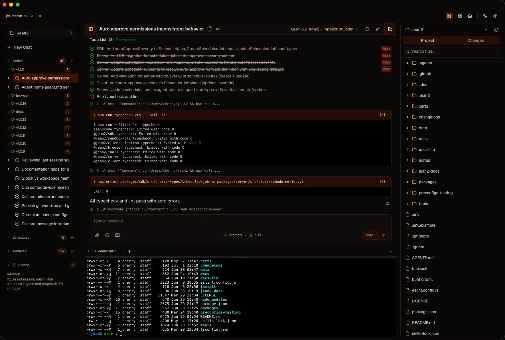

<p align="center">
  
</p>

<p align="center">
  <strong>Your AI agent. One server. Any device. No baked-in behavior.</strong>
</p>

<p align="center">
  A coding assistant, a research agent, a personal automation — same binary, different configuration.
</p>

<p align="center">
  <a href="https://jean2.ai/docs/getting-started">Get Started</a> ·
  <a href="https://jean2.ai">Docs</a> ·
  <a href="https://github.com/rabbyte-tech/jean2">GitHub</a>
</p>

---

## Quick Start

### Install (macOS / Linux)

```bash
curl -fsSL https://jean2.ai/install.sh | bash
```

### Run

```bash
jean2 init
jean2 start
```

Connect a client:

```bash
npx @jean2/client
```

> Desktop apps available for macOS, Windows, and iOS. See the [setup guide](https://jean2.ai/docs/getting-started) for all options.
>
> For development from source, see [Contributing](#contributing).

---

## What Sets It Apart

### 🧠 Any LLM

Connect any combination of LLM providers — OpenAI, Anthropic, Google, OpenRouter, or any OpenAI-compatible endpoint. Switch providers and models per-session. Budget models for routine tasks, premium for hard problems. No vendor lock-in.

### 🔧 Tools in Any Language

Write tools in any runtime — Bun, Node, Python, Bash, Go, Rust, anything. A tool is just a directory with a manifest and a script. Drop it in, the agent picks it up. No build step, no registration.

### 🔌 MCP & Skills

Connect any MCP server (local or remote, with OAuth). Define Skills as discoverable `SKILL.md` instruction sets. Both are automatically available to your agent sessions.

### 🤖 Subagent Orchestration

Agents spawn hierarchical subagents for complex tasks. Isolated sessions, inherited workspace context, cascading interrupts. Configure depth limits per preconfig.

### 🌐 Access From Anywhere

One persistent server. REST + WebSocket under the hood. Desktop, mobile, or browser — all connect the same way. Works over Tailscale, VPN, or local network.

### 🎯 Make It Yours

System prompts, tools, and skills are all files on disk. Edit them, add them, remove them. Download preset bundles or build from nothing. Your agent, your rules.

---

## Use Cases

| Use Case | Description |
|----------|-------------|
| **AI-Powered Coding** | Connect Claude, GPT-4o, or Gemini to your codebase. Subagents explore, refactor, and implement with full workspace isolation. |
| **Research & Analysis** | Give your agent tools to query APIs, scrape pages, and process documents. Isolated workspaces keep contexts separate. |
| **Deployment & Ops** | Connect MCP servers for Kubernetes, AWS, or Terraform. Multi-step deployment pipelines via subagent orchestration. |
| **Automation Workflows** | Create agent personalities for repetitive tasks. Skills let agents follow domain-specific workflows. Queue sessions for batch processing. |

---

## Tools

A set of built-in tools to get started with `jean2 init` — or pick what you need and write your own in any language.

| Tool | Description |
|------|-------------|
| **apply-patch** | Apply unified diff patches to files atomically |
| **edit** | String replacements in files with fuzzy matching |
| **glob** | Find files matching glob patterns |
| **read-file** | Read files and directory listings |
| **write-file** | Write content to files |
| **grep** | Search files with regex patterns |
| **bash** | Execute shell commands |

[+9 more tools available](https://jean2.ai/docs/tools/registry) · [Explore all tools](https://jean2.ai/docs/tools/registry)

> Tools execute in sandboxed child processes. Define optional security checks for dangerous operations.

---

## Architecture

```
┌─────────────────────────────────────────────────────────────────┐
│                       Client Layer                              │
│    ┌──────────┐  ┌──────────┐  ┌─────────────────────────┐      │
│    │ Desktop  │  │ iPhone   │  │ Web (npx @jean2/client) │      │
│    │ (Tauri)  │  │ (Tauri)  │  │                         │      │
│    └────┬─────┘  └────┬─────┘  └──────────┬──────────────┘      │
│         └─────────────┴───────────────────┘                     │
│                         ·                                       │
│              WebSocket + REST (any network)                     │
│              local · Tailscale · VPN · public                   │
└──────────────────────────┬──────────────────────────────────────┘
                           │
┌──────────────────────────┴──────────────────────────────────────┐
│                    Server (@jean2/server)                       │
│                                                                 │
│  ┌─────────────┐  ┌──────────┐  ┌───────────────────┐           │
│  │ Agent Loop  │  │ Tool     │  │ MCP Manager       │           │
│  │ (AI SDK v6) │  │ Executor │  │ (stdio + remote)  │           │
│  └──────┬──────┘  └────┬─────┘  └────────┬──────────┘           │
│         └──────────────┼─────────────────┘                      │
│               ┌────────┴───────────┐                            │
│               │   ~/.jean2/tools/  │                            │
│               │   (any runtime)    │                            │
│               └────────────────────┘                            │
│                     ┌──────────────┐                            │
│                     │ Subagent     │                            │
│                     │ Orchestrator │                            │
│                     └──────┬───────┘                            │
│               ┌────────────┴────────────┐                       │
│               │     SQLite Store        │                       │
│               │ Sessions · Messages     │                       │
│               │ Permissions · History   │                       │
│               └─────────────────────────┘                       │
│                                                                 │
│              Workspaces → directories on your machine           │
└──────────────────────────┴──────────────────────────────────────┘
```

### Packages

| Package | Description |
|---------|-------------|
| [`@jean2/server`](packages/server/README.md) | Agent loop, tool execution, REST + WebSocket API, SQLite, daemon mode |
| [`@jean2/client`](packages/client/README.md) | React 19 + Tauri 2 UI — chat, file browser, permissions, multi-server |
| [`@jean2/shared`](packages/shared/README.md) | Shared TypeScript types and WebSocket protocol definitions |

### Tech Stack

| Layer | Technology |
|-------|-----------|
| Runtime | [Bun](https://bun.sh/) |
| Server | [Hono](https://hono.dev/), AI SDK v6, SQLite |
| Client | React 19, Vite 6, TypeScript |
| UI | Tailwind CSS v4, shadcn/ui, Radix UI |
| Desktop / Mobile | [Tauri 2](https://tauri.app/) |
| LLM | Vercel AI SDK v6, MCP SDK |

---

## Sessions

- **Compact** — LLM-powered conversation summarization
- **Fork** — Branch any session at any message
- **Revert** — Undo to any previous point
- **Interrupt** — Cancel generation with automatic cascade to subagents
- **Queue** — Queue messages while the agent is busy
- **Remote Terminal** — Full PTY terminal with multi-tab support

---

## Configuration

All configuration lives in `~/.jean2/` — model definitions, API keys, tools, preconfigs, and workspace data. See the [configuration docs](https://jean2.ai/docs/getting-started) for the full reference.

---
## License

[Apache 2.0](LICENSE)
